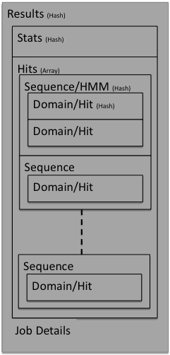

Appendices
==========

---------------------------------
Appendix A - Result object format
---------------------------------

The results are returned from the search servers as a binary data object. This
can be a little complex
when first looked at. However, the data structure is fairly simple and
is represented pictorially below:

In the following sections the contents of each part of the results
data structure will be described. Parts of the data structure will be
referred to as hashes (key, value pairs) or arrays, but depending on
the type of response requested will translate into different entities,
for example elements and attributes for an XML response.

"Results" hash
++++++++++++++

+-----------+-------------------------------------------+
| stats     | The stats hash                            |
+-----------+-------------------------------------------+
| hits      | Array of sequence hashes                  |
+-----------+-------------------------------------------+
| uuid      | The unique job identifier                 |
+-----------+-------------------------------------------+
| algo      | The HMMER search algorithm                |
+-----------+-------------------------------------------+
| searchDB  | The target search database                |
+-----------+-------------------------------------------+
| _internal | Hash containing some internal accounting  |
+-----------+-------------------------------------------+

"Stats" hash
++++++++++++

+-----------+-----------------------------------------------------------+
| nhits     |  The number of hits found above reporting thresholds      |
+-----------+-----------------------------------------------------------+
| Z         |  The number of sequences or models in the target database |
+-----------+-----------------------------------------------------------+
| domZ      |  The number of hits in the target database                |
+-----------+-----------------------------------------------------------+
| nmodels   |  The number of models in this search                      |
+-----------+-----------------------------------------------------------+
| nincluded |  The number of sequences or models scoring above the      |
|           |  significance threshold                                   |
+-----------+-----------------------------------------------------------+
| nreported |  The number of sequences or models scoring above the      |
|           |  reporting threshold                                      |
+-----------+-----------------------------------------------------------+

"Sequence" hash
+++++++++++++++

The hits array contains one or more sequences. Only parts of the response
actually deemed useful will be described. With the non-redundant
databases, the redundant sequence information will also be included,
but as the sequences are identical, the information about the hit is
identical.

+------------+-----------------------------------------------------------+
| name       | Name of the target (sequence for phmmer/hmmsearch,        |
|            | HMM for hmmscan)                                          |
+------------+-----------------------------------------------------------+
| acc        | Accession of the target                                   |
+------------+-----------------------------------------------------------+
| acc2       | Secondary accession of the target                         |
+------------+-----------------------------------------------------------+
| id         | Identifier of the target                                  |
+------------+-----------------------------------------------------------+
| desc       | Description of the target                                 |
+------------+-----------------------------------------------------------+
| score      | Bit score of the sequence (all domains,                   |
|            | without correction)                                       |
+------------+-----------------------------------------------------------+
| pvalue     | P-value of the score                                      |
+------------+-----------------------------------------------------------+
| evalue     | E-value of the score                                      |
+------------+-----------------------------------------------------------+
| nregions   | Number of regions evaluated                               |
+------------+-----------------------------------------------------------+
| nenvelopes | Number of envelopes handed over for domain definition,    |
|            | null2, alignment, and scoring.                            |
+------------+-----------------------------------------------------------+
| ndom       | Total number of domains identified in this sequence       |
+------------+-----------------------------------------------------------+
| nreported  | Number of domains satisfying reporting thresholding       |
+------------+-----------------------------------------------------------+
| nincluded  | Number of domains satisfying inclusion thresholding       |
+------------+-----------------------------------------------------------+
| taxid      | The NCBI taxonomy identifier of the target                |
|            | (if applicable)                                           |
+------------+-----------------------------------------------------------+
| species    | The species name of the target (if applicable)            |
+------------+-----------------------------------------------------------+
| kg         | The kingdom of life that the target belongs to - based on |
|            | placing in the NCBI taxonomy tree (if applicable)         |
+------------+-----------------------------------------------------------+
| seqs       | An array containing information about the                 |
|            | 100% redundant sequences                                  |
+------------+-----------------------------------------------------------+
| pdbs       | Array of pdb identifiers (which chains information)       |
+------------+-----------------------------------------------------------+

"Domain" Hash
+++++++++++++

The domain or hit hash contains the details of the match,
in particular the alignment between the query and the target.

+-------------+-----------------------------------------+
| ienv        | Envelope start position                 |
+-------------+-----------------------------------------+
| jenv        | Envelope end position                   |
+-------------+-----------------------------------------+
| iali        | Alignment start position                |
+-------------+-----------------------------------------+
| jali        | Alignment end position                  |
+-------------+-----------------------------------------+
| bias        | null2 score contribution                |
+-------------+-----------------------------------------+
| oasc        | Optimal alignment accuracy score        |
+-------------+-----------------------------------------+
| bitscore    | Overall score in bits, null corrected,  |
|             | if this were the only domain in seq     |
+-------------+-----------------------------------------+
| cevalue     | Conditional E-value based on the domain |
|             | correction                              |
+-------------+-----------------------------------------+
| ievalue     | Independent E-value based on the domain |
|             | correction                              |
+-------------+-----------------------------------------+
| is_reported | 1 if domain meets reporting thresholds  |
+-------------+-----------------------------------------+
| is_included | 1 if domain meets inclusion thresholds  |
+-------------+-----------------------------------------+
| alimodel    | Aligned query consensus sequence phmmer |
|             | and hmmsearch, target hmm for hmmscan   |
+-------------+-----------------------------------------+
| alimline    | Match line indicating identities,       |
|             | conservation +'s, gaps                  |
+-------------+-----------------------------------------+
| aliaseq     | Aligned target sequence for phmmer and  |
|             | hmmsearch, query for hmmscan            |
+-------------+-----------------------------------------+
| alippline   | Posterior probability annotation        |
+-------------+-----------------------------------------+
| alihmmname  | Name of HMM (query sequence for phmmer, |
|             | alignment for hmmsearch and target hmm  |
|             | for hmmscan)                            |
+-------------+-----------------------------------------+
| alihmmacc   | Accession of HMM                        |
+-------------+-----------------------------------------+
| alihmmdesc  | Description of HMM                      |
+-------------+-----------------------------------------+
| alihmmfrom  | Start position on HMM                   |
+-------------+-----------------------------------------+
| alihmmto    | End position on HMM                     |
+-------------+-----------------------------------------+
| aliM        | Length of model                         |
+-------------+-----------------------------------------+
| alisqname   | Name of target sequence (phmmer,        |
|             | hmmscan) or query sequence(hmmscan)     |
+-------------+-----------------------------------------+
| alisqacc    | Accession of sequence                   |
+-------------+-----------------------------------------+
| alisqdesc   | Description of sequence                 |
+-------------+-----------------------------------------+
| alisqfrom   | Start position on sequence              |
+-------------+-----------------------------------------+
| alisqto     | End position on sequence                |
+-------------+-----------------------------------------+
| aliL        | Length of sequence                      |
+-------------+-----------------------------------------+

---------------------------
Appendix B - response codes
---------------------------

One of the philosophies of a RESTful API is to also pass the appropriate
HTTP status code in response to the query URL. Most of the time a 200
(success) status code will be received. However, there may be times when
that is not the case. There is a complete
`list of HTTP codes <http://en.wikipedia.org/wiki/List_of_HTTP_status_codes>`_
elsewhere, but
we have listed most of the status codes that may be returned and how
they relate to what is actually going on at the server.

200 (OK)
  The job has either been run or queued up successfully. In the former
  case, the body should contain the results, whereas the latter will
  contain your job identifier that can be used to query/fetch the results
  in the future.

201 (Create)
  The job has been created successfully. Response will contain either the
  content describing the job and/or a redirection to the created resource
  in the HTTP header.

202 (Accepted)
  The job has been accepted by the search system and is either pending
  (waiting to be started) or running. After a short delay, your script
  should check for results again.

302 (Found/Redirection)
  The request was found, but the client must take additional action to
  complete the request. Usually there is a redirection URL found in the
  response header.

400 (Bad Request)
  Your job contained either invalid parameters or parameter values. The
  body of your response should contain information about which parameter
  or value failed and possibly the reason why it failed. If you continue
  to receive this in response to a request and can not understand why it
  is failing, you should contact the help desk for assistance.

410 (Gone)
  Your job was deleted from the search system. This may be because the
  time that we have been able to store the results has expired or that you
  have explicitly asked for the results to be deleted.

500 (Internal server error)
  There was a problem with running your job, typically due to a problem
  with the back-end compute servers, rather than the job itself. The body
  of the response may contain an error message from the server. Contact
  the help desk for assistance with the problem.

502 (Bad gateway)
  There was a problem scheduling or running the job. The job has failed
  and will not produce results. There is no need to check the status
  again.

503 (Service unavailable)
  The body of the response may contain a message as to why the job has
  been put on hold. This may be due to site maintenance, database updates,
  queue overload or if there is a problem. This status is set typically by
  an administrator and should this status code be present for longer that
  a few hours, you should contact the help desk.

-------------------------
Appendix C - data formats
-------------------------

The RESTful interface supports three different, commonly used, machine
readable formats: XML, JSON and YAML. In addition to these, we also
provide HTML and text. Which format used is really down to personal
choice. XML is widely used with libraries in many different languages.
JSON is readily applicable to use with websites, in which a server may make
a call to a HMMER web service and pass the resulting JSON string back to
the client/browser, where the HMMER result may be post-processed by
JavaScript running on the client. YAML is a more recent markup language
which, despite being readily parsed by software, is more human-readable
than XML or JSON. The HTML responses are not really meant for anything
other than a browser or command line tools such as curl or wget. The
text output is the best output if you want to cut and paste results into
a lab book.

---------------------------------
Appendix D - unsupported features
---------------------------------

We have tried to provide as many services as possible via REST. However,
there are still a few things that we do not provide. For example, there
is no way of generating a domain graphic or getting a graph of the
distribution of hits. We can not provide this via REST as the both of
these are generated client side using JavaScript libraries and the HTML5
canvas element. The RESTful services are also, naturally, restricted to
just the set of HMMER programs that are available via the website. But,
if there is something that you think would be useful, then please get in
touch and we will consider it for inclusion.

-------------------
Appendix E - Job ID
-------------------

The job ID, also refered to as UUID (Universally Unique IDentifier),
is a 36 character sequence that looks like
*10F15DB0-2E1C-11E0-B944-D59DDB6B6FDE* and that uniquely identifies a
job submitted on the website.

------------------------
Appendix F - JSON format
------------------------

The results visualised in the score, taxonomy and architecture views are all
available using the API in JSON format. For the score endpoint, the object
returned includes the Stats, Sequence and Domain hashes referred to above
(Appendix A).

The taxonomy endpoint provides a recursive hash of the tree with the keys

+------------------+------------------------------------------+
| id               | NCBI taxonomy identifier                 |
+------------------+------------------------------------------+
| parentid         | taxonomy identifier of parent            |
+------------------+------------------------------------------+
| name             | taxonomy name                            |
+------------------+------------------------------------------+
| hitcount         | number of hits to this node              |
+------------------+------------------------------------------+
| hitdist          | binned log e-values of hits to this node |
+------------------+------------------------------------------+
| children         | children of this node (recursive)        |
+------------------+------------------------------------------+

